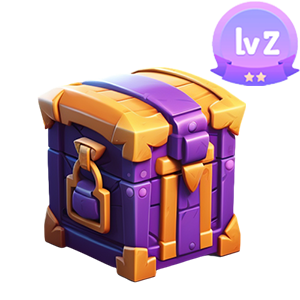
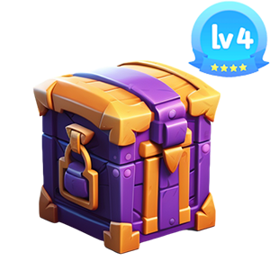

# Props

<figure><figcaption></figcaption></figure>

 

<figure><figcaption></figcaption></figure>

 

<figure><figcaption></figcaption></figure>

 

<figure><figcaption></figcaption></figure>

 

<figure><figcaption></figcaption></figure>

 

<figure><figcaption></figcaption></figure>

***

| name        | tokenid |
| ----------- | ------- |
| Level 1 box | 1       |
| Level 2 box | 2       |
| Level 3 box | 3       |
| Level 4 box | 4       |
| Level 5 box | 5       |
| Level 6 box | 6       |
