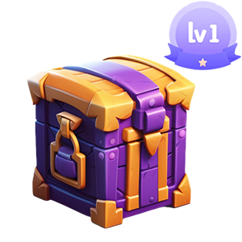
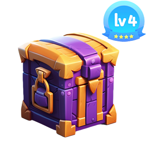
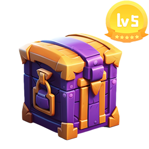

# ✨ Box

##

<figure><figcaption></figcaption></figure>

 

<figure><figcaption></figcaption></figure>

 

<figure><figcaption></figcaption></figure>

 

<figure><figcaption></figcaption></figure>

 

<figure><figcaption></figcaption></figure>

 

<figure><figcaption></figcaption></figure>

## Description

### Type

#### P2E

* **Level 1 box**

Game scores 1-10, get.

* **Level 2 box**

Game scores 11-20, get.

* **Level 3 box**

Game scores 21-30, get.

* **Level 4 box**

Game scores 31-40, get.

* **Level 5 box**

Game scores 41-50, get.

* **Level 6 box**

Game scores 50+, get.

#### Ativities

Box nft acquired by different activities, different boxes contain different nft.

### Open Box

Use Gas to open different boxes to get different on-chain tokens, nft.


Different boxes require different values of gas, based on the data on the chain.

[Data info Link](../data-sheet/box-info.md#open-gas)

