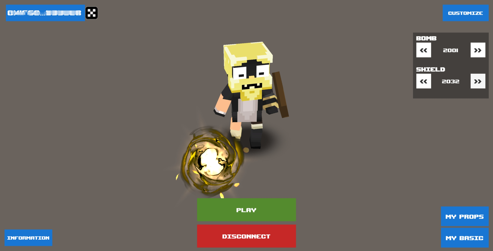
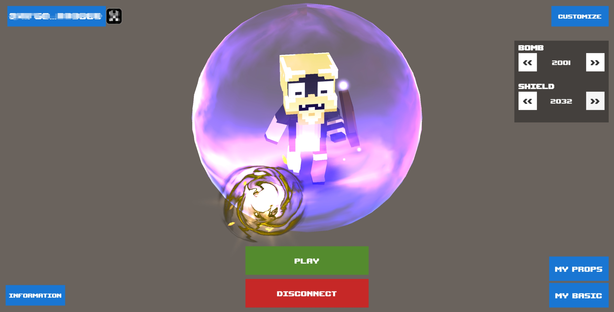

# 😍 Game Buffs

##

<figure><figcaption></figcaption></figure>

 

<figure><figcaption></figcaption></figure>

## Types

### BombRange

The number of squares covered by the explosive power of the bomb.The upper limit is 9.

### BombAmount

The maximum number of bombs that can be placed.The upper limit is 9.

### ShieldAmount

Effective number of light shields.The upper limit is 9.

### MoveSpeed

The character's movement speed.The upper limit is 9.

## Resurrect

| Conditions                  | BUFF                                   |
| --------------------------- | -------------------------------------- |
| 17 body parts.              | 
ShieldAmount +1 MoveSpeed +1
 |
| 1 body outfit.              | 
ShieldAmount +1 MoveSpeed +1
 |
| Non-default bombs.          | 
BombRange + n BombAmount + n
 |
| Non-default shield effects. | 
CanKickBomb ShieldAmount +n
  |
