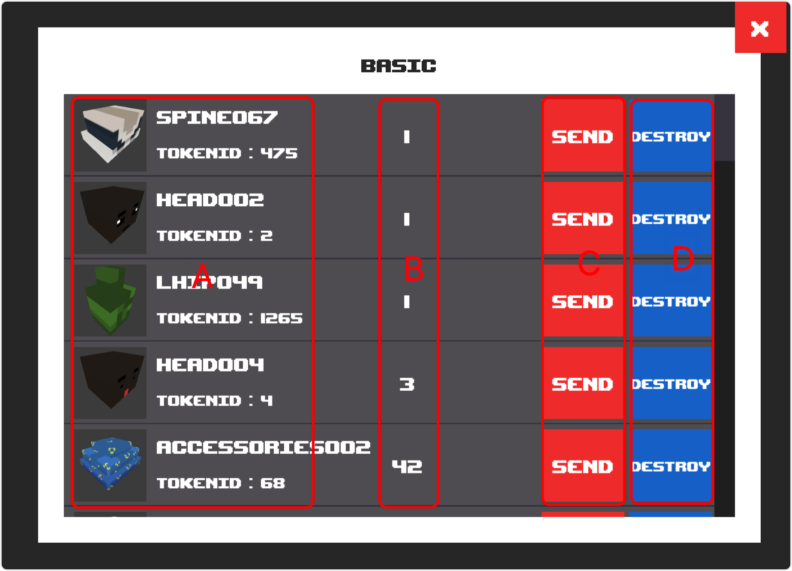

# Basic

## Screenshot

<figure><figcaption></figcaption></figure>

## Description

The current wallet address holds a BASIC NFT that can be sent & sold.

### Mark A

The list shows the token ids of all basic nfts held by the wallet.

### Mark B

The number of current wallet holdings of various classes nft.

### Mark C

Send basic nft.

### Mark D

Destroy the nft and get the corresponding credits.


Destruction operations require that you first authorize the contract to operate basicnft, which can be done by clicking the approval button.

