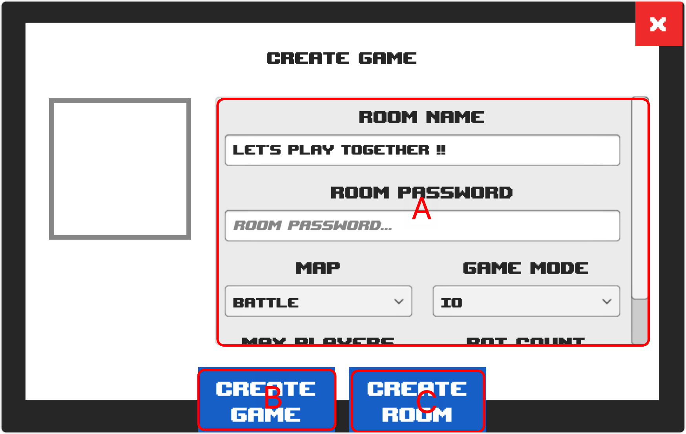

# Create Room

## Screenshot

<figure><figcaption></figcaption></figure>

## Description

### Mark A

Details of the game room settings.

* **Room Name**
* **Room Password**
* **Map**
* **Game Mode**
* **Max Players**
* **Bot Count**
* **Match Time**
* **Max Kill**

### Mark B

Create a game to join directly into the game.

### Mark C

Create a game room to enter the waiting lobby.
