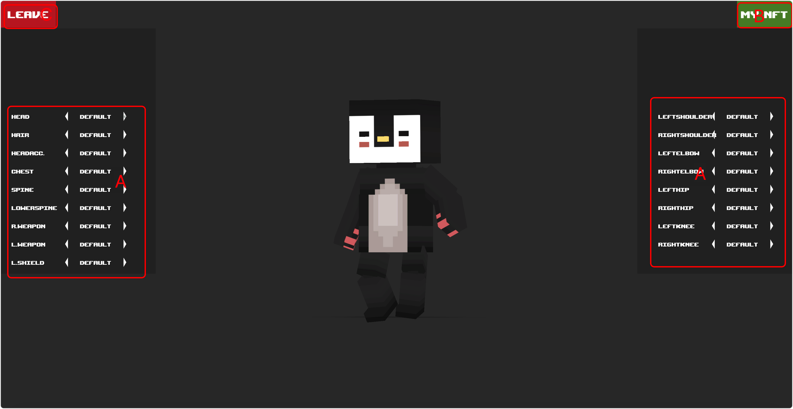
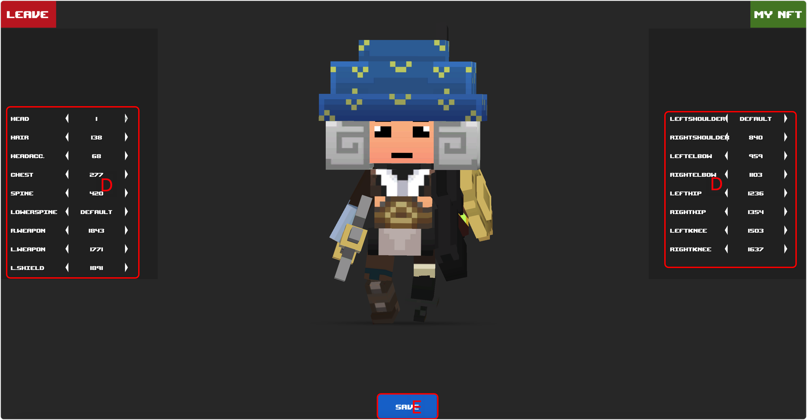

# Custom

## Screenshot

<figure><figcaption></figcaption></figure>

 

<figure><figcaption></figcaption></figure>

## Description

### Mark A

Showing all tokenid of 17 categories. easy to view 3d models with corresponding tokenid.

### Mark B

View the current wallet holdings of BASIC NFT.

### Mark C

Exits the current stylization settings.

### Mark D

Displays the currently held Basic nft according to the different classifications. the player sets the currently displayed nft.

### Mark E

Saves the nft tokenid for each currently selected part.


Parts that are not set are displayed with the default model.



Select the data to be saved locally, which will become invalid after changing browsers or other terminals, and can be reconfigured.

