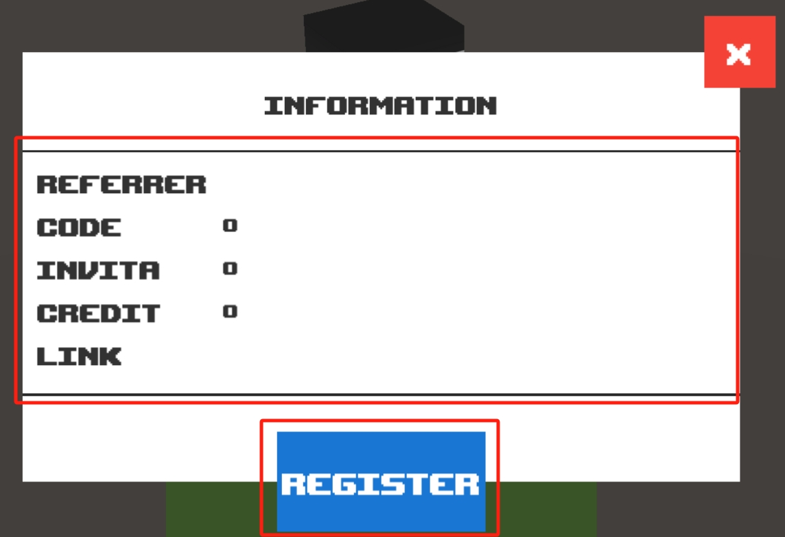
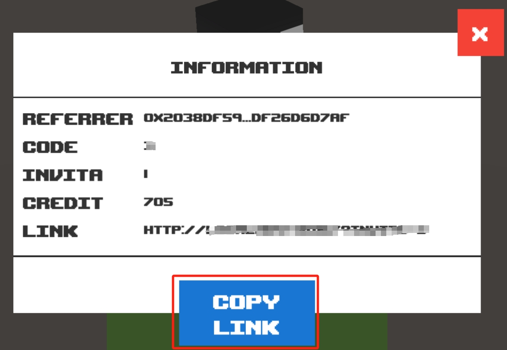

# Information

## Screenshot

<figure><figcaption></figcaption></figure>

 

<figure><figcaption></figcaption></figure>

## Description

### Mark A

Displays information associated with the current wallet address.

* **Referrer**

The Referrer address to which the current wallet address is bound.

* **Code**

Invitation code for registration at the current wallet address.

* **Invita**

The number of people invited to the current address.

* **Credit**

Credits for the current wallet address. Points are earned by the invitee's participation in games and check-in activities. You get 2 points for checking in, 5 points for one game for invitees, and 1 point for secondary referrers.


Credits can be exchanged for in-game NFTs.Destroying BasicNFT can also be exchanged for corresponding credits.


* **Link**

Invitation link for current wallet registration for easy promotion. Other gamers are automatically chained to the binding relationship after they play the game through this link and submit it successfully.

### Mark B

Current wallet registration on-chain invitation code.Current wallet registration on-chain invitation code. If already registered here will change to Copy link button.


After successfully playing the game in the invitee's wallet, the contract adds 5 points at a time to the promoter's wallet address. Add 1 point at a time to the secondary promoter.

