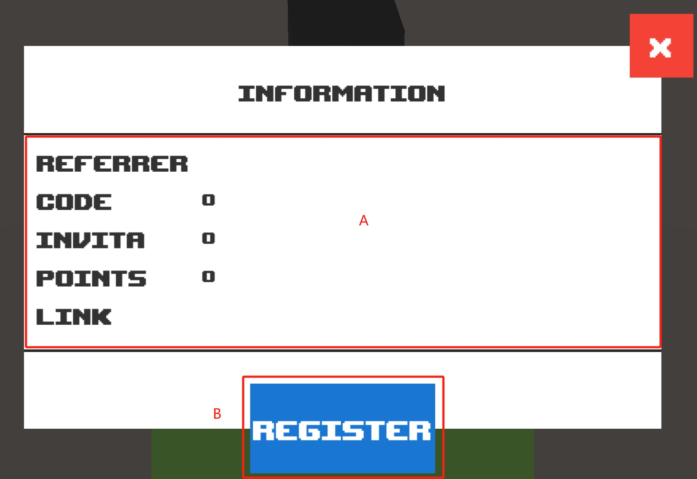

# Information

## Screenshot

<figure><figcaption></figcaption></figure>

 

<figure><figcaption></figcaption></figure>

## Description

### Mark A

Displays information associated with the current wallet address.

* **Referrer**

The Referrer address to which the current wallet address is bound.

* **Code**

Invitation code for registration at the current wallet address.

* **Invita**

The number of people invited to the current address.

* **Points**

Points for the current wallet address. Points are earned by the invitee's participation in games and check-in activities.&#x20;


Points can be exchanged for in-game NFTs.


* **Link**

Invitation link for current wallet registration for easy promotion. Other gamers are automatically chained to the binding relationship after they play the game through this link and submit it successfully.

### Mark B

Current wallet registration on-chain invitation code.Current wallet registration on-chain invitation code. If already registered here will change to Copy link button.


After successfully playing the game in the invitee's wallet, the contract adds 1 point at a time to the promoter's wallet address.

