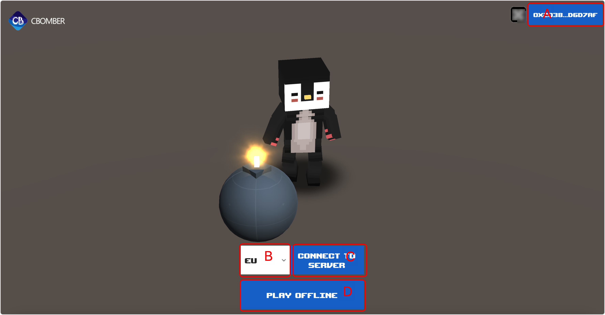

# Login

## Screenshot

<figure><figcaption></figcaption></figure>

## Description


Functions are described according to the letter markings in the screenshots.


### Mark A

The button to connect to the wallet, here you need to have the Metamask wallet plugin installed in your browser, it will automatically pop up asking for authorization. After confirmation you can access the blockchain network.After a successful connection, the currently accessed wallet address is displayed. Experience the CBomber product.


Users are required to install their own wallet plugins such as metamask.


### Mark B

Choose a game server that better suits the user.

Server international codes are **`eu,us,asia,au,jp,usw,sa,cae,kr,in,za,tr,ussc`**

### Mark C

After selecting mark a server and clicking the button to join the server, you will be automatically redirected to the main page of the game after a successful connection.

### Mark D

Added to the offline game, you can create rooms to play against bots once you enter the game.


The Auto Match function is not available in offline mode.

