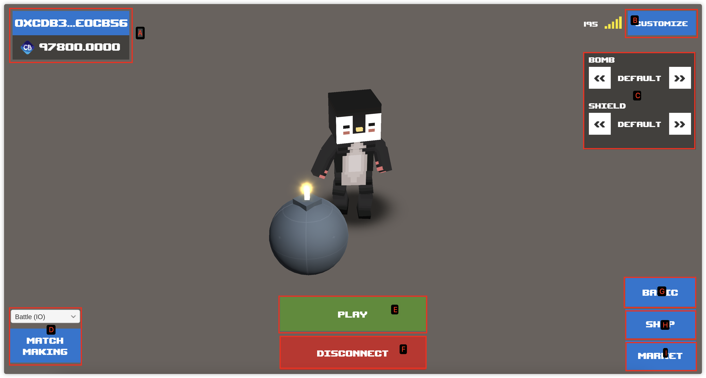

# Main

## Screenshot

<figure><figcaption></figcaption></figure>

## Description

### Mark A

The address of the currently connected wallet and the number of tokens.

### Mark B

Jump to set custom stylization, users can view all tokenid and set their own nft.

Detailed settings jump to [Custom](custom.md).

### Mark C

The current wallet holds the Bomb & Shield NFT and makes a selection of configurations to play.

### Mark D

Select the game mode to be matched to join the corresponding game room.

### Mark E

To start a game, open the list of rooms currently in play and view the [ServerList](server-list.md) page in detail.

### Mark F

Disconnect from the server and exit to the [login](login.md) page.

### Mark G

Jump to basic page to see the basic nft held by the wallet, and also support sending , check [Basic](basic.md) in detail.

### Mark H

Shopping page for Bombs & Shields NFT.

### Mark I

Jump to the nft trading market page.

