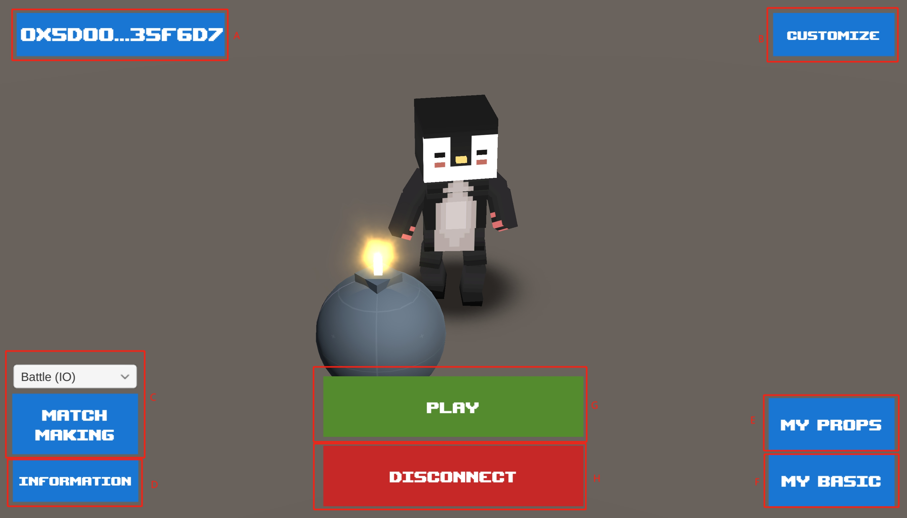

# Main

## Screenshot

<figure><figcaption></figcaption></figure>

## Description

### Mark A

Displays the current connected wallet address.

### Mark B

Jump to set custom stylization, users can view all tokenid and set their own nft.

Detailed settings jump to [Custom](custom.md).

### Mark C

Select the game mode to be matched to join the corresponding game room.

### Mark D

Jump to info to see the current wallet's invitees, credits, promo codes, and registered promotional links on the detailed view [Information](information.md).

### Mark E

Jump to the props page to view the props nft held by the wallet, and also support authorization, sending, open box, shelving, and redemption functions to view the [props](props.md) in detail.

### Mark F

Jump to basic page to see the basic nft held by the wallet, and also support sending and redeeming function, check [Basic](basic.md) in detail.

### Mark G

To start a game, open the list of rooms currently in play and view the [ServerList](server-list.md) page in detail.

### Mark H

Disconnect from the server and exit to the [login](login.md) page.

