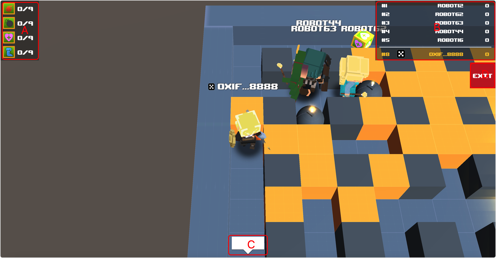

# IO

## Screenshot

<figure><figcaption></figcaption></figure>

 

<figure><figcaption></figcaption></figure>

 

<figure><figcaption></figcaption></figure>

## Description

IO mode, the room does not end automatically, after being killed can be submitted to the chain for settlement, according to the score to get the corresponding level props nft, kill an opponent can be 2 points.

### Mark A

A list of the number of props the game gets.

1. Explosive power, equal to the number of squares exploded.
2. The number of bombs that can be placed.
3. Protect yourself from bombs.
4. The number of bombs that can be kicked.

### Mark B

Game score information.

### Mark C

Chat function.

### Mark D

Exit the game.

### Mark E

Submit game scores for on-chain settlement.

### Mark F

Rejoin the game.

### Mark G

Chat multiple ways.
