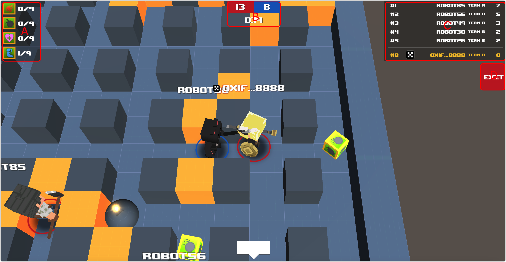
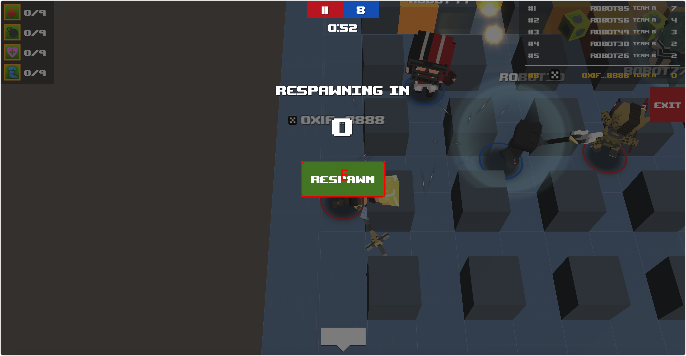
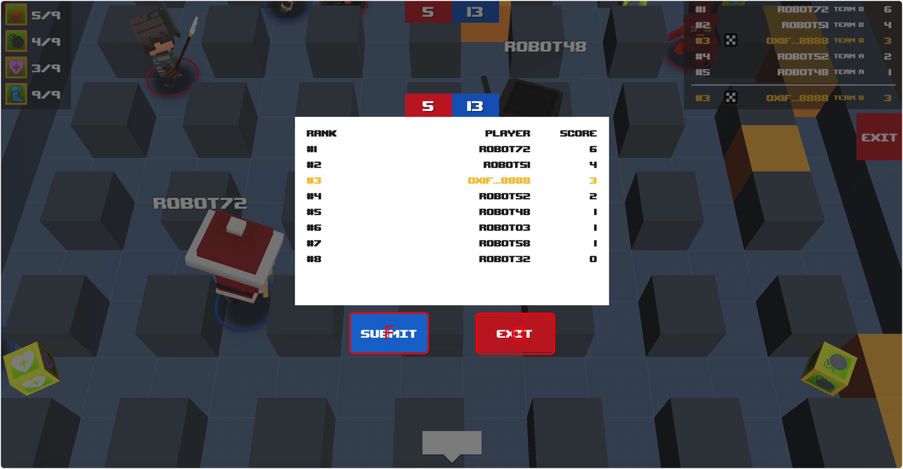

# Team Death Match

## Screenshot

<figure><figcaption></figcaption></figure>

 

<figure><figcaption></figcaption></figure>

 

<figure><figcaption></figcaption></figure>

## Description

team death match mode, according to the game room specified time to play, the final player to submit the results of the chain settlement, according to the results to get the chain settlement reward. kill an opponent can be 1 points.

### Mark A

A list of the number of props the game gets.

1. Explosive power, equal to the number of squares exploded.
2. The number of bombs that can be placed.
3. Protect yourself from bombs.
4. The number of bombs that can be kicked.

### Mark B

Game countdown with team scoring information.

### Mark C

Game score information.

### Mark D

Exit the game.

### Mark E

Rejoin the game.

### Mark F

Submit game scores for on-chain settlement.

### Mark G

Exit the game.
