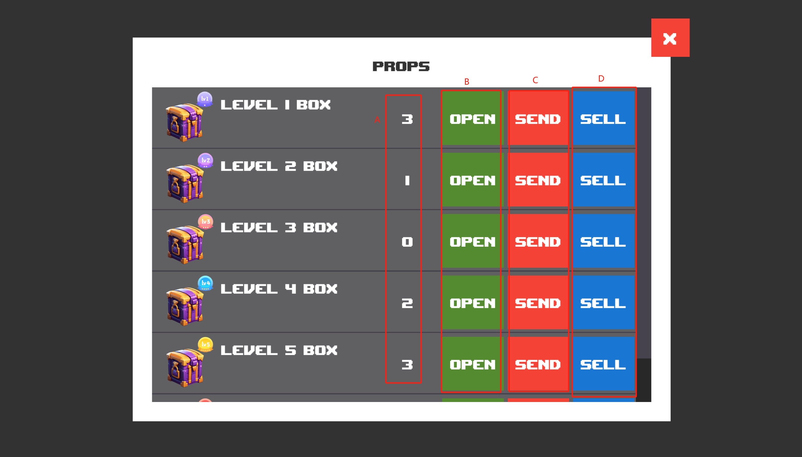

# Props

## Screenshot

<figure><figcaption></figcaption></figure>

## Description

There are 6 different levels of crates nft, and the crates can be opened for different rewards. Chests are obtained through the game performance level P2E.

### Mark A

The number of current wallet holdings of various classes nft.

### Mark B

Open the corresponding chest and chain up the settlement to get the corresponding reward.

### Mark C

Send props nft.

### Mark D

Sell props nft.Sold to the trade market.


Click the approval button. Authorize to open the chest contract so that you can open the chest for random items.

