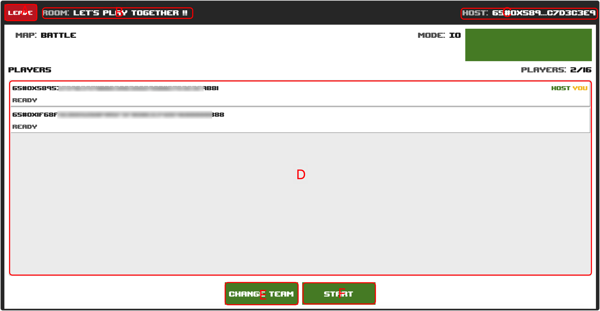

# Room Lobby

## Screenshot

<figure><figcaption></figcaption></figure>

## Description

### Mark A

Leave Room.

### Mark B

Gameplay Setup.

### Mark C

Room management address.

### Mark D

The current list of players who have joined the game on vacation.

### Mark E

Switch teams.

### Mark F

Start the game.
