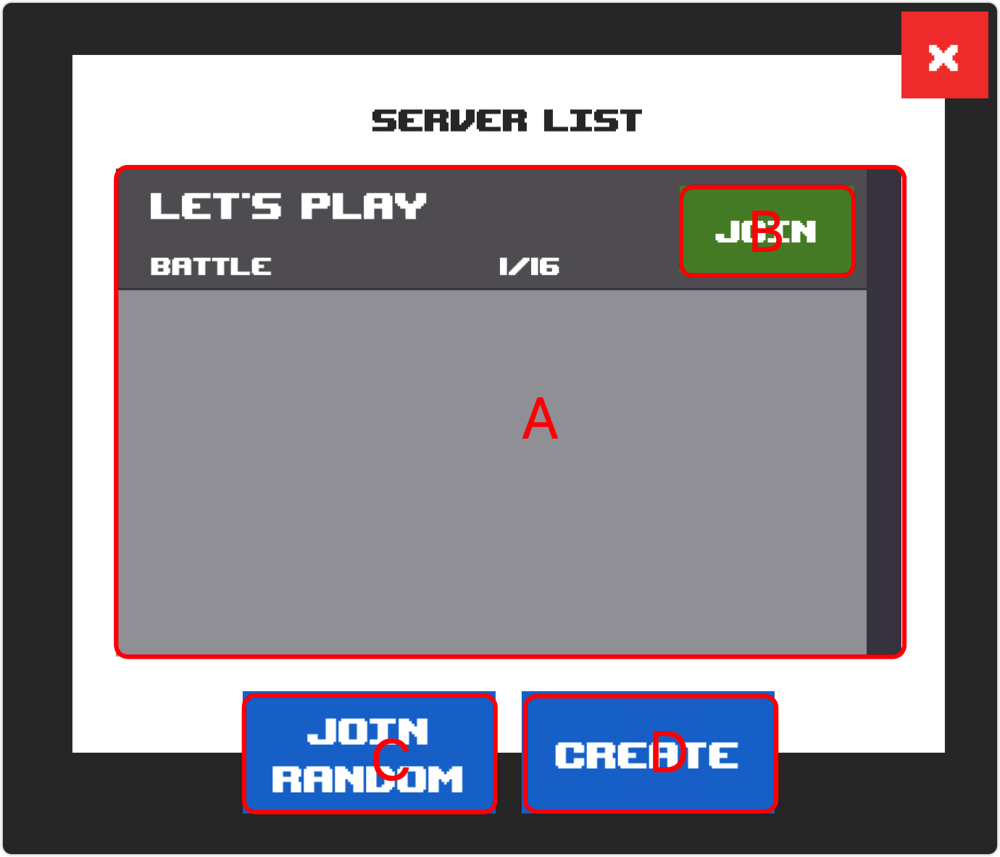

# Server List

## Screenshot

<figure><figcaption></figcaption></figure>

## Description

### Mark A

Displays all current game rooms with the option to join.

### Mark B

Join the game room.

### Mark C

Randomly join the game room.

### Mark D

Create a new game room.
